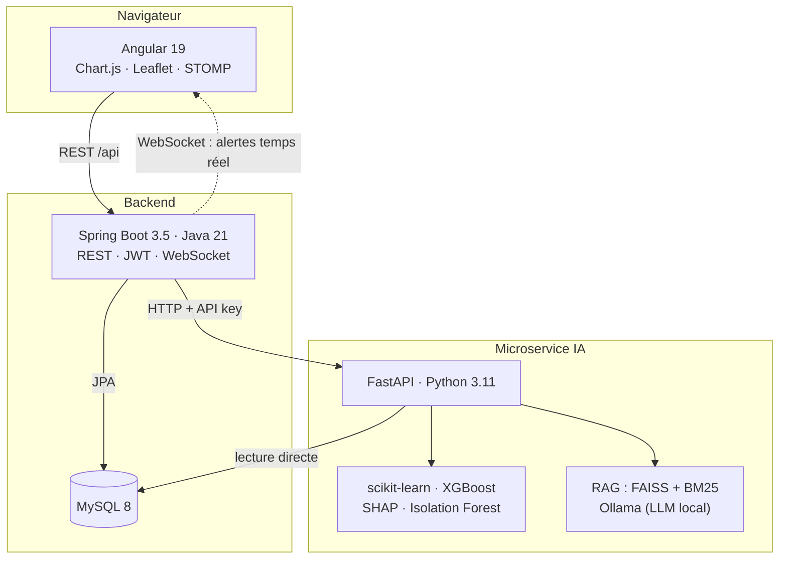

# AGIL Energy

**Plateforme d'aide à la décision pour la gestion prédictive de stations-service**
*Decision-support platform for predictive fuel-station management*

🔗 **[Démo en ligne / Live demo](https://aymenayoun.github.io/agil_energy/)** — aucune installation, aucun backend, trois rôles à explorer.

[](https://github.com/aymenayoun/agil_energy/actions/workflows/ci.yml)


> 🇫🇷 Version française ci-dessous · 🇬🇧 [English version](#-english)

---

## Le problème

Une station-service qui tombe en rupture de carburant perd une journée de chiffre d'affaires et envoie ses clients chez le concurrent. Une station sur-approvisionnée immobilise de la trésorerie dans des cuves et paie des livraisons inutiles.

Entre les deux, il faut répondre à une question simple mais difficile : **combien de litres seront vendus la semaine prochaine, dans cette station, pour ce carburant ?**

La demande dépend du jour de la semaine, des vacances scolaires, du Ramadan, des jours fériés, de la météo, des variations de prix et de la position géographique. Un gestionnaire ne peut pas tenir cela de tête pour vingt-cinq stations et six carburants.

## Ce que fait la plateforme

AGIL Energy apprend l'historique de consommation de chaque couple station/carburant, le croise avec neuf sources de données externes, et produit :

| | |
|---|---|
| 📈 **Prévisions à 7 jours** | Par station et par carburant, avec intervalles de confiance |
| ⏳ **Jours avant rupture** | Stock actuel ÷ demande prévue, par cuve |
| 🚨 **Alertes automatiques** | Rupture imminente, anomalie de consommation, vente aberrante |
| 🔍 **Explications SHAP** | *Pourquoi* le modèle prévoit cette valeur — quelle variable pèse combien |
| 💬 **Assistant IA** | Questions en langage naturel sur les données, en français |
| 🗺️ **Vue régionale** | Agrégation par gouvernorat, carte interactive |

Trois profils d'utilisateur, avec des périmètres différents :

- **Administrateur** — toutes les stations, gestion des utilisateurs, journal d'audit
- **Responsable régional** — les stations de sa région uniquement
- **Responsable de station** — sa station uniquement

---

## 🏗️ Architecture



**Pourquoi trois services ?** Le backend Java gère l'authentification, les règles métier et la persistance — un terrain où Spring est solide. L'écosystème scientifique Python (scikit-learn, XGBoost, SHAP) n'a pas d'équivalent sur la JVM. Les séparer permet d'entraîner les modèles sans redéployer l'application, et de les faire évoluer indépendamment.

### Stack technique

| Couche | Technologies |
|---|---|
| **Frontend** | Angular 19 (standalone components), Chart.js, Leaflet, STOMP/SockJS |
| **Backend** | Spring Boot 3.5, Java 21, Spring Security + JWT, Spring Data JPA, WebSocket |
| **IA / ML** | FastAPI, scikit-learn, XGBoost, SHAP, Isolation Forest, Prophet |
| **RAG / LLM** | Ollama (modèle local), FAISS, BM25, embeddings `nomic-embed-text` |
| **Données** | MySQL 8 |
| **Infra** | Docker Compose, GitHub Actions, GHCR, JaCoCo, Playwright |

---

## 🤖 Méthodologie ML

### Features

Chaque prédiction s'appuie sur des variables construites à partir de l'historique de ventes et de neuf jeux de données externes :

**Temporelles** — jour de la semaine, mois, jour du mois, indicateur week-end
**Retards (lags)** — consommation à J-1, J-7, J-14, J-30
**Moyennes mobiles** — fenêtres glissantes à 7 et 30 jours, écart-type
**Calendaires** — jours fériés tunisiens, vacances scolaires, Ramadan et fêtes religieuses
**Contextuelles** — prix du carburant, météo historique, promotions, pannes et fermetures
**Structurelles** — géographie de la station, infrastructure (nombre de pompes, capacité des cuves)

### Modèles

Trois régresseurs sont entraînés en parallèle sur chaque couple station/carburant :

1. **Régression linéaire** — référence interprétable
2. **Random Forest** — relations non linéaires, robuste au bruit
3. **XGBoost** — gradient boosting, généralement le plus performant

Le modèle retenu est celui dont le MAPE est le plus faible sur le jeu de test. Une **pondération d'ensemble** inversement proportionnelle à l'erreur de chaque modèle est également calculée.

> **Note sur Prophet** — Prophet est présent dans le code mais désactivé : le backend Stan requis n'est pas disponible dans l'image Docker sans une étape de compilation `cmdstanpy` qui alourdit considérablement le build. Les trois autres modèles le surpassaient systématiquement sur ces données.

### Au-delà du point de prévision

- **Intervalles quantiles** (P10 / P50 / P90) avec calibration empirique du taux de couverture
- **SHAP** — contribution de chaque variable à chaque prédiction, affichée dans l'interface
- **Isolation Forest** — détection non supervisée d'anomalies de consommation
- **Détection de ventes aberrantes** — Z-score sur fenêtre glissante de 90 jours

### Assistant conversationnel (RAG)

L'assistant répond à des questions en français sur les données réelles de la plateforme. Il combine :

- une **recherche hybride** — FAISS (dense, sémantique) + BM25 (lexical, termes exacts)
- des **embeddings** `nomic-embed-text` servis par Ollama
- un **LLM local** via Ollama, sans appel à une API externe

Tout tourne en local : aucune donnée métier ne quitte l'infrastructure.

---

## 📊 Résultats

### Validation externe (jeu de données public UCI)

Les modèles ont été évalués sur un jeu de données de consommation publique, indépendant des données synthétiques du projet. C'est le résultat le plus significatif, car il ne dépend pas de données générées par nous.

| Modèle | MAPE | RMSE | R² | Précision directionnelle |
|---|---|---|---|---|
| **XGBoost** | **6.28 %** | 1 082 | **0.923** | 92.3 % |
| Random Forest | 7.54 % | 1 173 | 0.909 | 69.2 % |

XGBoost prédit la bonne direction de variation dans plus de neuf cas sur dix, avec un biais de prévision de −0.57 % — autrement dit, pratiquement pas de tendance systématique à sur- ou sous-estimer.

### En production (données du projet)

Sur les couples station/carburant de la base de démonstration, le pipeline rapporte un MAPE de **6 à 12 %** selon la paire, XGBoost l'emportant dans la majorité des cas.

### ⚠️ Limites connues

Un projet honnête documente ce qui ne marche pas encore :

- **Les données métier sont synthétiques.** AGIL Energy a été développé pendant un stage, sans accès à des données de vente réelles. L'historique a été généré pour être réaliste, mais les modèles n'ont jamais vu de vraies ventes.
- **Le jeu de test interne est petit.** L'évaluation sur les données synthétiques porte sur un horizon de test très court, ce qui produit des métriques instables et peu significatives. C'est pourquoi la validation externe UCI est mise en avant ici.
- **Fuite de cible sur la régression linéaire en validation UCI.** Le script d'évaluation produit un MAPE de 0.00 % et un R² de 1.0 pour la régression linéaire — un résultat impossible qui signale qu'une variable dérivée de la cible subsiste dans le jeu de features pour ce modèle. La ligne est volontairement exclue du tableau ci-dessus. Correction à venir.
- **L'assistant IA est lent sur CPU** — environ 60 secondes par réponse sans GPU.

---

## 🚀 Démarrage rapide

### Prérequis

- Docker Desktop
- **Ollama** installé et lancé sur la machine hôte (pour l'assistant IA uniquement — le reste fonctionne sans)

```bash
# Installer Ollama : https://ollama.com
ollama pull nomic-embed-text
ollama serve
```

Le microservice Python contacte Ollama via `host.docker.internal:11434`. Ollama n'est volontairement pas conteneurisé : cela permet d'utiliser une installation GPU existante sur la machine hôte.

### Lancement

```bash
git clone https://github.com/aymenayoun/agil_energy.git
cd agil_energy

cp .env.example .env
# Renseigner DB_PASSWORD, JWT_SECRET et IA_API_KEY dans .env
# JWT_SECRET doit être une clé base64 d'au moins 256 bits

docker compose up -d --build
```

| Service | URL |
|---|---|
| Application | http://localhost:4200 |
| API (Swagger) | http://localhost:8082/swagger-ui.html |
| Microservice IA | http://localhost:5000/docs |

### Comptes de démonstration

La base est initialisée avec des données synthétiques et trois comptes, mot de passe commun `Admin@2026` :

| Email | Rôle | Périmètre |
|---|---|---|
| `demo.admin@agil.tn` | Administrateur | Toutes les stations |
| `demo.manager@agil.tn` | Responsable régional | Région Tunis |
| `demo.station@agil.tn` | Responsable station | Station La Marsa |

> L'authentification à deux facteurs est active pour les administrateurs. Sans configuration SMTP, posez `OTP_ENABLED=false` dans `.env`, puis `docker compose up -d --force-recreate backend`.

### Générer les prévisions

Au premier lancement, la base ne contient pas encore de prévisions. Connectez-vous en administrateur, ouvrez **Prévisions IA** et lancez **Batch toutes les stations**. L'entraînement prend quelques minutes sur CPU.

---

## 🧪 Qualité

- **Tests unitaires backend** — JUnit 5 + Mockito, couverture mesurée par JaCoCo
- **Tests unitaires frontend** — Karma + Jasmine
- **Tests end-to-end** — Playwright
- **CI** — GitHub Actions : build, tests, couverture, publication d'images Docker sur GHCR

---

## 📁 Structure

```
.
├── backend/              # Spring Boot — API REST, sécurité, métier
├── frontend/             # Angular — interface, mode démo
├── agil-energy-ia/       # FastAPI — ML, SHAP, RAG
│   ├── app/models/       # Entraînement et comparaison des modèles
│   ├── app/services/     # Pipeline de prédiction, feature engineering
│   ├── app/llm/          # RAG, recherche hybride, routage LLM
│   └── data/             # 9 jeux de données externes (CSV)
├── init-db/              # Schéma et données de démonstration
├── scripts/              # Génération de données, capture des fixtures
└── docker-compose.yml
```

---

## 🎭 À propos du mode démo

La démo en ligne tourne **sans backend**. Un intercepteur HTTP Angular, activé uniquement dans la configuration `demo`, redirige chaque appel API vers un fichier JSON statique capturé depuis l'application réelle. Le sélecteur de rôle en bas de l'écran recharge la session avec un autre profil.

Les données sont synthétiques et figées. Rien n'est écrit, aucun serveur n'est contacté.

---

## 📝 Contexte

Projet développé dans le cadre d'un stage de fin d'études (PFE) en génie logiciel, chez un distributeur de carburants. Le code publié ici est une version portfolio : les données sont entièrement synthétiques et aucune information d'exploitation réelle n'y figure.

**Aymen Ayouni** — Ingénieur en génie logiciel et systèmes d'information
[GitHub](https://github.com/aymenayoun) · [Site](https://aymenayoun.github.io)

---
---

# 🇬🇧 English

## The problem

A fuel station that runs dry loses a day of revenue and sends its customers to a competitor. An over-supplied station ties up cash in tanks and pays for deliveries it did not need.

Between those two failures sits a simple but hard question: **how many litres will this station sell next week, for this fuel?**

Demand depends on the day of the week, school holidays, Ramadan, public holidays, weather, price changes and location. No manager holds that in their head across twenty-five stations and six fuel types.

## What the platform does

AGIL Energy learns each station/fuel pair's consumption history, combines it with nine external data sources, and produces:

| | |
|---|---|
| 📈 **7-day forecasts** | Per station and fuel, with confidence intervals |
| ⏳ **Days until stockout** | Current stock ÷ forecast demand, per tank |
| 🚨 **Automatic alerts** | Imminent stockout, consumption anomaly, outlier sale |
| 🔍 **SHAP explanations** | *Why* the model predicts this value — which feature contributed what |
| 💬 **AI assistant** | Natural-language questions over the data |
| 🗺️ **Regional view** | Aggregation by governorate, interactive map |

Three user profiles with different scopes: **Administrator** (everything), **Regional manager** (one region), **Station manager** (one station).

---

## Architecture

See the [diagram above](#-architecture) — the labels are self-explanatory.

**Why three services?** The Java backend handles authentication, business rules and persistence, where Spring is strong. Python's scientific stack (scikit-learn, XGBoost, SHAP) has no real JVM equivalent. Separating them means models can be retrained without redeploying the application.

| Layer | Technologies |
|---|---|
| **Frontend** | Angular 19 (standalone components), Chart.js, Leaflet, STOMP/SockJS |
| **Backend** | Spring Boot 3.5, Java 21, Spring Security + JWT, Spring Data JPA, WebSocket |
| **AI / ML** | FastAPI, scikit-learn, XGBoost, SHAP, Isolation Forest, Prophet |
| **RAG / LLM** | Ollama (local model), FAISS, BM25, `nomic-embed-text` embeddings |
| **Data** | MySQL 8 |
| **Infra** | Docker Compose, GitHub Actions, GHCR, JaCoCo, Playwright |

---

## ML methodology

### Features

**Temporal** — day of week, month, day of month, weekend flag
**Lags** — consumption at D-1, D-7, D-14, D-30
**Rolling statistics** — 7- and 30-day moving averages and standard deviation
**Calendar** — Tunisian public holidays, school terms, Ramadan and religious festivals
**Contextual** — fuel prices, historical weather, promotions, outages and closures
**Structural** — station geography, infrastructure (pump count, tank capacity)

### Models

Three regressors are trained in parallel per station/fuel pair — **Linear Regression** (interpretable baseline), **Random Forest** (non-linear, noise-robust) and **XGBoost** (gradient boosting). The lowest test-set MAPE wins; an **ensemble weighting** inversely proportional to each model's error is also computed.

> **On Prophet** — Prophet is present but disabled: the required Stan backend is unavailable in the Docker image without a `cmdstanpy` compilation step that substantially inflates build time. The other three models consistently outperformed it on this data.

### Beyond the point forecast

- **Quantile intervals** (P10 / P50 / P90) with empirical coverage calibration
- **SHAP** — per-prediction feature attribution, surfaced in the UI
- **Isolation Forest** — unsupervised consumption-anomaly detection
- **Outlier sale detection** — Z-score over a rolling 90-day window

### Conversational assistant (RAG)

Hybrid retrieval combining **FAISS** (dense, semantic) with **BM25** (lexical, exact terms), `nomic-embed-text` embeddings, and a **local LLM via Ollama**. Nothing leaves the infrastructure — no external API calls.

---

## Results

### External validation (public UCI dataset)

Evaluated on a public consumption dataset independent of the project's synthetic data. This is the meaningful benchmark, because it does not depend on data we generated.

| Model | MAPE | RMSE | R² | Directional accuracy |
|---|---|---|---|---|
| **XGBoost** | **6.28%** | 1,082 | **0.923** | 92.3% |
| Random Forest | 7.54% | 1,173 | 0.909 | 69.2% |

XGBoost calls the direction of change correctly in more than nine cases out of ten, with a forecast bias of −0.57% — effectively no systematic tendency to over- or under-predict.

### In the running application

Across station/fuel pairs in the demo database, the pipeline reports **6–12% MAPE** depending on the pair, with XGBoost winning most of the time.

### ⚠️ Known limitations

An honest project documents what does not work yet:

- **The business data is synthetic.** AGIL Energy was built during an internship without access to real sales records. The history was generated to be realistic, but the models have never seen real transactions.
- **The internal test set is small.** Evaluation on synthetic data uses a very short test horizon, producing unstable and weakly meaningful metrics. This is why the external UCI validation is the figure presented here.
- **Target leakage in linear regression under UCI validation.** The evaluation script reports 0.00% MAPE and R² of 1.0 for linear regression — an impossible result indicating a target-derived feature remains in that model's feature set. The row is deliberately excluded from the table above. Fix pending.
- **The AI assistant is slow on CPU** — roughly 60 seconds per response without a GPU.

---

## Quick start

### Prerequisites

- Docker Desktop
- **Ollama** installed and running on the host machine (AI assistant only — everything else works without it)

```bash
# Install Ollama: https://ollama.com
ollama pull nomic-embed-text
ollama serve
```

The Python service reaches Ollama at `host.docker.internal:11434`. Ollama is deliberately not containerised, so an existing GPU installation on the host can be used.

### Run

```bash
git clone https://github.com/aymenayoun/agil_energy.git
cd agil_energy

cp .env.example .env
# Fill in DB_PASSWORD, JWT_SECRET and IA_API_KEY
# JWT_SECRET must be a base64 key of at least 256 bits

docker compose up -d --build
```

| Service | URL |
|---|---|
| Application | http://localhost:4200 |
| API (Swagger) | http://localhost:8082/swagger-ui.html |
| AI service | http://localhost:5000/docs |

### Demo accounts

Shared password `Admin@2026`:

| Email | Role | Scope |
|---|---|---|
| `demo.admin@agil.tn` | Administrator | All stations |
| `demo.manager@agil.tn` | Regional manager | Tunis region |
| `demo.station@agil.tn` | Station manager | Station La Marsa |

> Two-factor authentication is enabled for administrators. Without SMTP configured, set `OTP_ENABLED=false` in `.env`, then `docker compose up -d --force-recreate backend`.

### Generate forecasts

On first run the database holds no predictions. Log in as administrator, open **Prévisions IA** and run **Batch toutes les stations**. Training takes a few minutes on CPU.

---

## Quality

JUnit 5 + Mockito with JaCoCo coverage (backend), Karma + Jasmine (frontend), Playwright (end-to-end), and GitHub Actions running build, tests, coverage and Docker image publication to GHCR.

---

## About the demo mode

The live demo runs **with no backend**. An Angular HTTP interceptor, active only in the `demo` build configuration, redirects every API call to a static JSON file captured from the real application. The role selector at the bottom of the screen reloads the session under a different profile.

The data is synthetic and frozen. Nothing is written and no server is contacted.

---

## Context

Built as a final-year engineering project (PFE) in software engineering, at a fuel distributor. The code published here is a portfolio version: all data is synthetic and contains no real operational information.

**Aymen Ayouni** — Software and Information Systems Engineer
[GitHub](https://github.com/aymenayoun) · [Website](https://aymenayoun.github.io)
